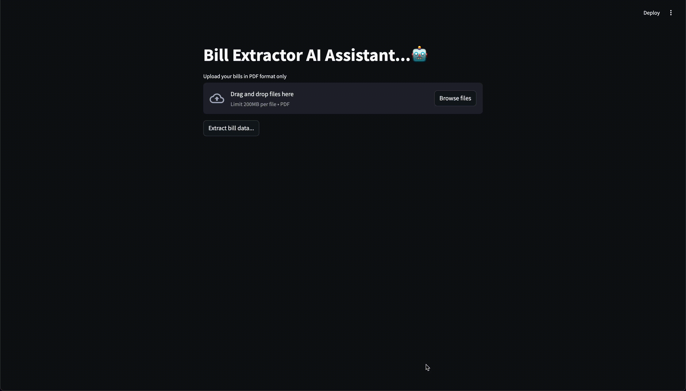

# AI-Powered Bill Extractor

Effortlessly extract and process information from bills using AI.

## Features ✨
- **Automated Data Extraction**: Extract key details like dates, amounts, and vendor names from bills.
- **User-Friendly Interface**: Simple and intuitive UI built with Streamlit.
- **Customizable**: Easily adapt the extractor for different bill formats.
- **Powered by OpenAI**: Leverages advanced language models for accurate data extraction.

## How It Works 🛠️
1. Upload a bill or receipt in PDF format.
2. The AI processes the document and extracts relevant information.
3. View or download the extracted data in a structured format.

## Video Demo 🎥


## Installation 🚀
1. Clone this repository:
   ```bash
   git clone https://github.com/victorggonzalez/billextractor.git
   cd billextractor
   ```
2. Install the required dependencies:
   ```bash
   pip install -r requirements.txt
   ```
3. Set up your `.env` file with your OpenAI API key:
   ```bash
   OPENAI_API_KEY=your_openai_api_key
   ```
4. Run the app:
   ```bash
   streamlit run app.py
   ```

## Example Output 📜
Here’s an example of the extracted data:
| Field         | Value          |
|---------------|----------------|
| Date          | 2023-10-01     |
| Vendor        | ABC Supplies   |
| Total Amount  | $123.45        |

## Contributing 🤝
Contributions are welcome! To contribute:
1. Fork the repository.
2. Create a new branch for your feature or bug fix.
3. Submit a pull request with a detailed description.

## License 📄
This project is licensed under the [MIT License](LICENSE).

## Acknowledgments 🙏
- Built with [Streamlit](https://streamlit.io/) for the UI.
- Powered by [OpenAI](https://openai.com/) for language processing.
- Inspired by the need for efficient document processing.
- Special thanks to the open-source community for their tools and libraries.